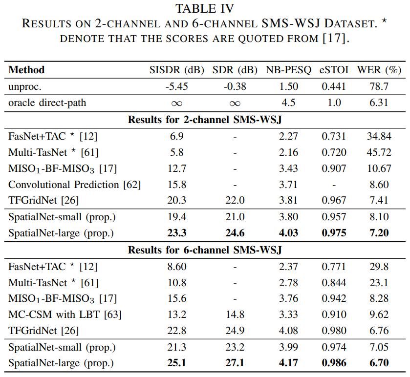
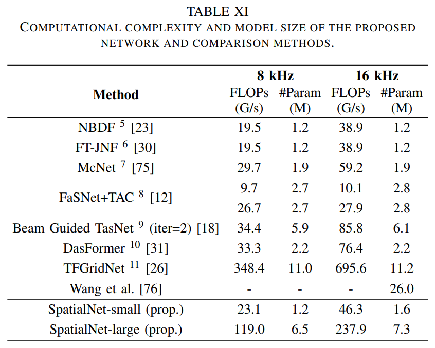

# Multichannel Speech Separation, Denoising and Dereverberation

The official repo of:  
[1] Changsheng Quan, Xiaofei Li. [Multi-channel Narrow-band Deep Speech Separation with Full-band Permutation Invariant Training](https://arxiv.org/abs/2110.05966). In ICASSP 2022.  
[2] Changsheng Quan, Xiaofei Li. [Multichannel Speech Separation with Narrow-band Conformer](https://arxiv.org/abs/2204.04464). In Interspeech 2022.  
[3] Changsheng Quan, Xiaofei Li. [NBC2: Multichannel Speech Separation with Revised Narrow-band Conformer](https://arxiv.org/abs/2212.02076). arXiv:2212.02076.  
[4] Changsheng Quan, Xiaofei Li. [SpatialNet: Extensively Learning Spatial Information for Multichannel Joint Speech Separation, Denoising and Dereverberation](https://arxiv.org/abs/2307.16516). TASLP, 2024.  
[5] Changsheng Quan, Xiaofei Li. [Multichannel Long-Term Streaming Neural Speech Enhancement for Static and Moving Speakers](https://arxiv.org/abs/2403.07675). IEEE Signal Precessing Letters, 2024.

Audio examples can be found at [https://audio.westlake.edu.cn/Research/nbss.htm](https://audio.westlake.edu.cn/Research/nbss.htm) and [https://audio.westlake.edu.cn/Research/SpatialNet.htm](https://audio.westlake.edu.cn/Research/SpatialNet.htm).
More information about our group can be found at [https://audio.westlake.edu.cn](https://audio.westlake.edu.cn/Publications.htm).

## Performance
SpatialNet: 
- Performance
  <br>
- Computational cost
  <br>

## Requirements

```bash
pip install -r requirements.txt

# gpuRIR: check https://github.com/DavidDiazGuerra/gpuRIR
```

## Generate Dataset SMS-WSJ-Plus

Generate rirs for the dataset `SMS-WSJ_plus` used in `SpatialNet` ablation experiment.

```bash
CUDA_VISIBLE_DEVICES=0 python generate_rirs.py --rir_dir ~/datasets/SMS_WSJ_Plus_rirs --save_to configs/datasets/sms_wsj_rir_cfg.npz
cp configs/datasets/sms_wsj_plus_diffuse.npz ~/datasets/SMS_WSJ_Plus_rirs/diffuse.npz # copy diffuse parameters
```

For SMS-WSJ, please see https://github.com/fgnt/sms_wsj

## Train & Test

This project is built on the `pytorch-lightning` package, in particular its [command line interface (CLI)](https://pytorch-lightning.readthedocs.io/en/latest/cli/lightning_cli_intermediate.html). Thus we recommond you to have some knowledge about the CLI in lightning. For Chinese user, you can learn CLI & lightning with this begining project [pytorch_lightning_template_for_beginners](https://github.com/Audio-WestlakeU/pytorch_lightning_template_for_beginners).

**Train** SpatialNet on the 0-th GPU with network config file `configs/SpatialNet.yaml` and dataset config file `configs/datasets/sms_wsj_plus.yaml` (replace the rir & clean speech dir before training).

```bash
python SharedTrainer.py fit \
 --config=configs/SpatialNet.yaml \ # network config
 --config=configs/datasets/sms_wsj_plus.yaml \ # dataset config
 --model.channels=[0,1,2,3,4,5] \ # the channels used
 --model.arch.dim_input=12 \ # input dim per T-F point, i.e. 2 * the number of channels
 --model.arch.dim_output=4 \ # output dim per T-F point, i.e. 2 * the number of sources
 --model.arch.num_freqs=129 \ # the number of frequencies, related to model.stft.n_fft
 --trainer.precision=bf16-mixed \ # mixed precision training, can also be 16-mixed or 32, where 32 can produce the best performance
 --model.compile=true \ # compile the network, requires torch>=2.0. the compiled model is trained much faster
 --data.batch_size=[2,4] \ # batch size for train and val
 --trainer.devices=0, \
 --trainer.max_epochs=100 # better performance may be obtained if more epochs are given
```

More gpus can be used by appending the gpu indexes to `trainer.devices`, e.g. `--trainer.devices=0,1,2,3,`.

**Resume** training from a checkpoint:

```bash
python SharedTrainer.py fit --config=logs/SpatialNet/version_x/config.yaml \
 --data.batch_size=[2,2] \
 --trainer.devices=0, \ 
 --ckpt_path=logs/SpatialNet/version_x/checkpoints/last.ckpt
```

where `version_x` should be replaced with the version you want to resume.

**Test** the model trained:

```bash
python SharedTrainer.py test --config=logs/SpatialNet/version_x/config.yaml \ 
 --ckpt_path=logs/SpatialNet/version_x/checkpoints/epochY_neg_si_sdrZ.ckpt \ 
 --trainer.devices=0,
```

## Module Version

| network | file |
|:---|:---|
| NB-BLSTM [1] / NBC [2] / NBC2 [3] | models/arch/NBSS.py |
| SpatialNet [4] | models/arch/SpatialNet.py |
| online SpatialNet [5] | models/arch/OnlineSpatialNet.py |

## Note
The dataset generation & training commands for the `NB-BLSTM`/`NBC`/`NBC2` are available in the `NBSS` branch.
